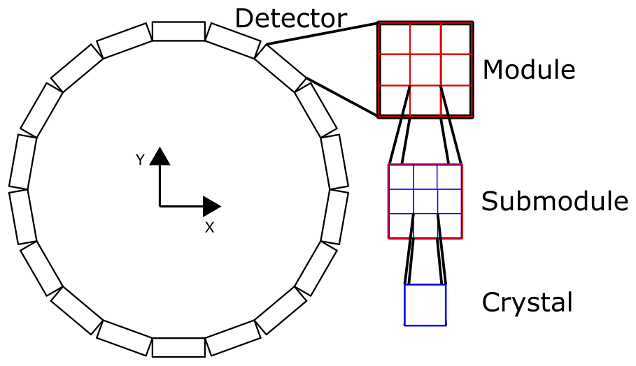

.. _imaging_geometries:

Detector Geometries
-------------------

As of the current TOPAS release (OpenTOPAS v4.0.0) there are two types of detectors, the :ref:`flat_panel` and the :ref:`ring_shaped`.

.. _flat_panel:

Flat-panel Detector
~~~~~~~~~~~~~~~~~~~

The flat-panel detector is widely used for medical imaging systems. In the context of its incorporation into TOPAS as an extension, it is used for Cone-beam CT and Prompt gamma imaging. The flat-panel detector in this extension is composed of 4 components:

* The anti-scatter grid,
* Prefilter,
* Scintillator, and
* Thin-film transistor

.. image:: flat_panel.png
	:width: 800

The :ref:`CBCT example <cbct_detector>` can be used as a reference for the creation of a flat-panel detector in TOPAS. The size of the detector is determined by the size of the scintillator, and as depicted in this example, the detector is composed of a carbon filter, CsI scintillation layer, and photodetector. An anti-scatter grid can be added by setting the following boolean parameter to ``True``::

	b:Ge/CBCTImager/Collimator/Exists = "True"

The scintillating crystal can be either cyclindrical or cubic. If you want to use rectangular crystals, you need to define::

	Ge/CBCTImager/Crystal/HLX
	Ge/CBCTImager/Crystal/HLY
	Ge/CBCTImager/Crystal/HLZ

instead of::

	Ge/CBCTImager/Crystal/HL
	Ge/CBCTImager/Crystal/Radius

The remaining set of parameters for the creation of a flat-panel detector are the following::

	#======== Flat imager ========
	s:Ge/CBCTImager/Type        = "FlatImager"
	s:Ge/CBCTImager/Material    = "Vacuum"
	s:Ge/CBCTImager/Parent      = "World"
	d:Ge/CBCTImager/TransZ      = -500 mm
	d:Ge/CBCTImager/HLX         = Ge/CBCTImager/Crystal/HLX mm * Ge/CBCTImager/Crystal/NbOfXBins
	d:Ge/CBCTImager/HLY         = Ge/CBCTImager/Crystal/HLY mm * Ge/CBCTImager/Crystal/NbOfYBins
	d:Ge/CBCTImager/HLZ         = Ge/CBCTImager/Crystal/HLZ mm * Ge/CBCTImager/Crystal/NbOfZBins

	#======== Anti-scatter grid ========
	b:Ge/CBCTImager/Collimator/Exists                    = "False"
	s:Ge/CBCTImager/Collimator/Material                  = "G4_W"
	s:Ge/CBCTImager/Collimator/OpeningMaterial           = "Air"
	d:Ge/CBCTImager/Collimator/HL                        = 10 mm
	u:Ge/CBCTImager/Collimator/XSeptaThicknessPercentage = 0.2
	u:Ge/CBCTImager/Collimator/ZSeptaThicknessPercentage = 0.2

	#======== Prefilter ========
	sv:Ge/CBCTImager/Prefilters/Materials   = 1 "Carbon"
	dv:Ge/CBCTImager/Prefilters/Thicknesses = 1 50 um

	#======== Scintillator ======
	s:Ge/CBCTImager/Crystal/Material           = "CsI"
	s:Ge/CBCTImager/Crystal/Shape              = "Cylinder" # "Box"
	d:Ge/CBCTImager/Crystal/HL                 = 18 mm
	d:Ge/CBCTImager/Crystal/Radius             = 9.0 mm
	d:Ge/CBCTImager/Crystal/ReflectorThickenss = 1.2 mm
	s:Ge/CBCTImager/Crystal/ReflectorMaterial  = "SiO2"
	i:Ge/CBCTImager/Crystal/NbOfXBins          = 11
	i:Ge/CBCTImager/Crystal/NbOfYBins          = 11
	i:Ge/CBCTImager/Crystal/NbOfZBins          = 1
	d:Ge/CBCTImager/Crystal/XGap               = 0 mm
	d:Ge/CBCTImager/Crystal/ZGap               = 0 mm

	#======== Photodetector ========
	s:Ge/CBCTImager/PhotoDetector/Type      = "TsBox"
	d:Ge/CBCTImager/PhotoDetector/HLZ       = 180 um
	s:Ge/CBCTImager/PhotoDetector/Material  = "SiO2"
	i:Ge/CBCTImager/PhotoDetector/XBins     = 512
	i:Ge/CBCTImager/PhotoDetector/YBins     = 512

.. _ring_shaped:

Ring-shaped Detector
~~~~~~~~~~~~~~~~~~~~

The ring-shaped detector is another type of detector commonly used for PET or SPECT systems. As in clinical systems, the ring-shaped detector in TOPAS has a hierarchical structure, namely the detector is composed of modules, which are composed of submodules, which are composed of crystals, as shown in the figure below.

In this example, there are no gaps between the different components. This is because, for example, the submodule has the same half length as the crystal half length multiplied by the number of bins in the respective direction. If the size of the submodule was larger than that of the crystals, or the size of the modules was larger than that of the submodules, or the size of the detector was larger than that of the modules, then there would be a gap between the different components. These sizing and gap considerations can be modified by playing with the parameters below::

	#======== Crystals ========
	d:Ge/PETScanner/CrystalHLX = 1.168835 mm
	d:Ge/PETScanner/CrystalHLY = 10 mm
	d:Ge/PETScanner/CrystalHLZ = 1.168835 mm
	i:Ge/PETScanner/NbOfXBins  = 22
	i:Ge/PETScanner/NbOfYBins  = 1
	i:Ge/PETScanner/NbOfZBins  = 22

	#======== Submodule ========
	d:Ge/PETScanner/SubmoduleHLX    = Ge/PETScanner/CrystalHLX mm * Ge/PETScanner/NbOfXBins
	d:Ge/PETScanner/SubmoduleHLY    = Ge/PETScanner/CrystalHLY mm * Ge/PETScanner/NbOfYBins
	d:Ge/PETScanner/SubmoduleHLZ    = Ge/PETScanner/CrystalHLZ mm * Ge/PETScanner/NbOfZBins
	i:Ge/PETScanner/NbOfSubmodulesX = 1
	i:Ge/PETScanner/NbOfSubmodulesY = 1
	i:Ge/PETScanner/NbOfSubmodulesZ = 1

	#======== Module ========
	d:Ge/PETScanner/ModuleHLX    = Ge/PETScanner/SubmoduleHLX mm * Ge/PETScanner/NbOfSubmodulesX
	d:Ge/PETScanner/ModuleHLY    = Ge/PETScanner/SubmoduleHLY mm * Ge/PETScanner/NbOfSubmodulesY
	d:Ge/PETScanner/ModuleHLZ    = Ge/PETScanner/SubmoduleHLZ mm * Ge/PETScanner/NbOfSubmodulesZ
	i:Ge/PETScanner/NbOfModulesX = 1
	i:Ge/PETScanner/NbOfModulesY = 1
	i:Ge/PETScanner/NbOfModulesZ = 4

	#======== Detector ========
	d:Ge/PETScanner/HLX           = Ge/PETScanner/ModuleHLX mm * Ge/PETScanner/NbOfModulesX
	d:Ge/PETScanner/HLY           = Ge/PETScanner/ModuleHLY mm * Ge/PETScanner/NbOfModulesY
	d:Ge/PETScanner/HLZ           = Ge/PETScanner/ModuleHLZ mm * Ge/PETScanner/NbOfModulesZ
	d:Ge/PETScanner/RingRadius    = 173.25 mm
	d:Ge/PETScanner/MarginRings   = 0 mm
	i:Ge/PETScanner/NbOfDetectors = 21

.. note:: The parameter ``Ge/CheckForOverlaps`` cannot detect overlaps within custom geometries. Instead use ``b:Ge/CheckInsideEnvelopesForOverlaps = "True"`` to detect overlaps.

