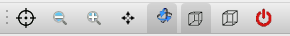
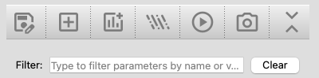
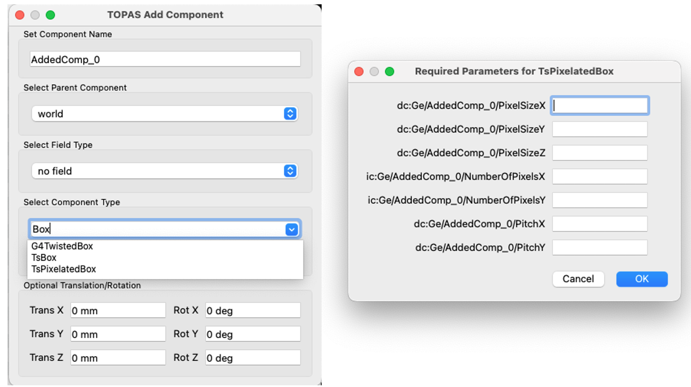
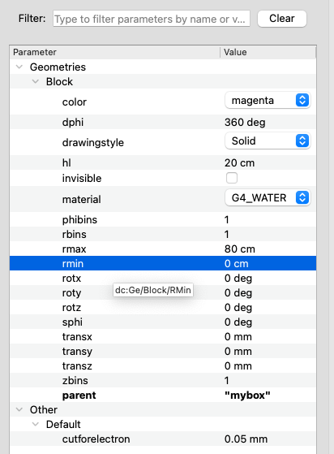
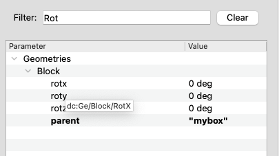
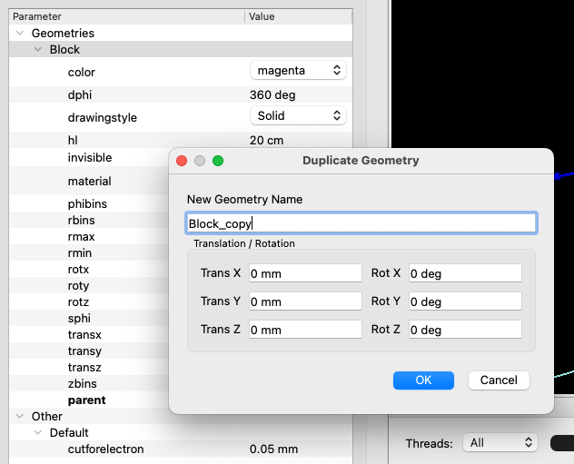

TOPAS Graphical User Interface
==============================

The Qt GUI adds a **Parameter Control** tab to TOPAS for quickly inspecting geometry, tweaking changeable parameters, running sequences, and capturing views. Use it for rapid prototyping; large production runs typically stay batch-only.

Version
--------
QT5 and QT6 are supported, and the selection of which version will be used by TOPAS is done at `cmake` time by adding the variables `TOPAS_USE_QT` and `TOPAS_USE_QT6` (**there is no default**) as follows:

- QT5 version active: `-DTOPAS_USE_QT=ON -DTOPAS_USE_QT6=OFF`
- QT6 version active: `-DTOPAS_USE_QT=ON -DTOPAS_USE_QT6=ON`

**The docker image only supports QT5**

Enable the GUI
--------------
- Build TOPAS with Qt/OpenGL available. The GUI auto-activates on some platforms when OpenGL is requested when you add in your parameter file::

    b:Ts/UseQt = "True" 

- Optional: to keep the default Geant4 Qt widgets use the following parameter, otherwise the TOPAS tab replaces them.::

    Ts/IncludeDefaultGeant4QtWidgets = "True"

- Run TOPAS normally; the Qt window opens with the TOPAS tab added.

.. image:: ./GUI.png
   :alt: TOPAS Qt GUI window
   :width: 90%

Mouse controls (graphics window)
--------------------------------
Top-row Geant4 Qt icons control interaction: pick, zoom in/out, move (pan), rotate, perspective view, orthogonal view and exit. Use these to explore the scene while adjusting parameters.

Parameter Control
-----------------------

Toolbar actions
---------------
- Hover over an icon displays its funtion.
- |save_icon| **Save**: prompt for a filename (defaults to ``Ts/ChangedParametersFile`` or ``ChangedParameters_1.txt``) and write only parameters changed in the session. 
- |geom_icon| **+Geom**: create new geometry components. Components can optionally be placed in dipole/quadrupole fields (before the first run) and given initial translations/rotations.
- |scorer_icon| **+Scorer**: create new scorers, can only be added before the first run.
- |source_icon| **+Source**: create new sources, can only be added before the first run.
- |run_icon| **Run**: execute the sequence with current edits. If ``Ge/QuitIfOverlapDetected`` is true and overlaps exist, the run is blocked.
- |capture_icon| **Capture**: export the current OpenGL view to PDF.
- **Expand/Collapse**: toggle expansion of all parameter categories.

Required-parameter prompts
--------------------------
- The “Select Component Type” dropdown is editable with type-ahead search.
- When adding components from the GUI, any known required parameters are collected up front in a dialog.
- String fields are auto-quoted if you omit quotes; numeric fields still expect units when applicable.
- Leaving a field blank skips adding that parameter (useful when you plan to supply defaults via include files).

Parameter Control table
-----------------------
- Rows appear for parameters marked changeable: prefix the type with ``c``/``ic``/``dc`` etc. (for example ``ic:Ge/MyBox/HLX = 2``). Non-changeable variants (``i:...``) are hidden.
- Items in bold are read-only (e.g., geometry type/parent, scorer quantity/component, source type). Booleans use checkboxes; enums use drop-downs; other values are inline-editable with units.

- Filter bar above the tree matches names or values. Edits apply immediately; invalid entries revert with a warning.
- Hover over a parameter displays its full TOPAS parameter syntax

Context menu and duplication
----------------------------
- Right-click a geometry or source header in the tree to duplicate it.
- **Duplicate Geometry** copies a component; you can override translation/rotation before creating the copy. **Duplicates have not changable parameters**.
- **Duplicate Geometry Tree** copies a component and all descendants using a chosen prefix while remapping parents inside the subtree.
- **Duplicate Source** is available only before the first run. Scorers cannot be duplicated because key scorer parameters are read-only.

Notes and tips
--------------
- Added components/scorers/sources start with suggested names; change them before creation if desired. A read-only notice can be suppressed via “Don't show again.”
- Save files from the GUI can be included in later runs to replay a GUI session in batch mode or as a starting point for scripted runs.
- **TsDicomPatient**: when creating a geometry component using DICOM ensure that the image-to-material conversion parameters match with the name of the new component. E.g., in the examples/Patient/ files, the component name "Patient" is used, and `HUtoMaterialSchneider.txt` has parameters associated to this.
- Extra sequence files listed in ``Ts/ExtraSequenceFiles`` run after the main sequence when you press **Run**.

More on extra sequence files
----------------------------
- ``Ts/ExtraSequenceFiles`` lists parameter files that run **after** the main sequence completes. Each file is read, its parameters applied, rebuilds occur, and a fresh sequence run starts.
- Files must not contain ``IncludeFile`` directives. If a listed file is missing, TOPAS sleeps ``Ts/ExtraSequenceSleepInterval`` between checks until ``Ts/ExtraSequenceSleepLimit`` is reached, then quits.
- Typical uses: chaining follow-on runs with small tweaks (geometry offsets, source settings, output names) or letting an external script drop in the next parameter set while TOPAS waits.

Geometry Extensions
-------------------
- User-defined Geometry Extensions can self-register via ``TsGeometryHub::RegisterGeometryType``, so their types appear in the GUI selector automatically and can declare required fields for prompting.
- All registered types are listed in the GUI; user-defined extensions built with ``-DTOPAS_EXTENSIONS_DIR=...`` shown heir own parameters. 

Example: registering an extension component
-------------------------------------------

Add a small register in your component’s code before the constructor (recommended)

.. code-block:: c++

   #include "TsGeometryHub.hh"
   #include "TsMyCustomComponent.hh"

   namespace {
   struct RegisterMyCustomComponent {
       RegisterMyCustomComponent() {
           TsGeometryHub::RegisterGeometryType({
               "TsMyCustomComponent",  // Canonical GUI name
                {
                   return new TsMyCustomComponent(pM, eM, mM, gM, pgc, pv, childName);
               },
               /* DefaultsCreator */ nullptr, // optional; seed defaults if desired
               {   // Required-at-creation params; leave DefaultValue "" to force a GUI prompt
                   {"s:Ge/{child}/InputFile", ""},  // string will auto-quote if user omits quotes
                   {"dc:Ge/{child}/Size", "1. cm"}  // example with a default
               }
           });
       }
   } registerMyCustomComponent; // static instance
   } // namespace

   TsMyCustomComponent::TsMyCustomComponent(TsParameterManager* pM, TsExtensionManager* eM, TsMaterialManager* mM, TsGeometryManager* gM,
TsVGeometryComponent* parentComponent, G4VPhysicalVolume* parentVolume, G4String& name) {;}

Notes:

- Placing the register in the component’s ``.cc`` ensures registration happens when the extension is loaded; no changes to core are needed.
- Use ``RequiredParameters`` to drive the GUI prompt; defaults are auto-added only when provided.

.. |save_icon| image:: ./save_as.svg
   :height: 32
.. |geom_icon| image:: ./add_box.svg
   :height: 32
.. |scorer_icon| image:: ./add_chart.svg
   :height: 32
.. |source_icon| image:: ./add_flash.svg
   :height: 32
.. |run_icon| image:: ./play.svg
   :height: 32
.. |capture_icon| image:: ./photo.svg
   :height: 32

