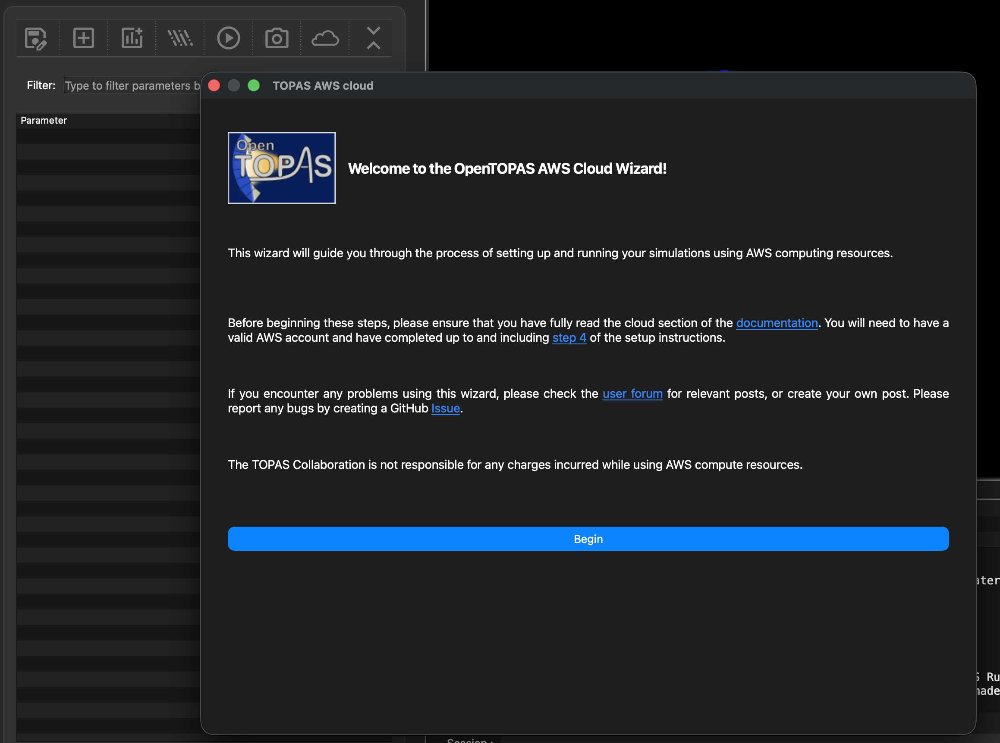
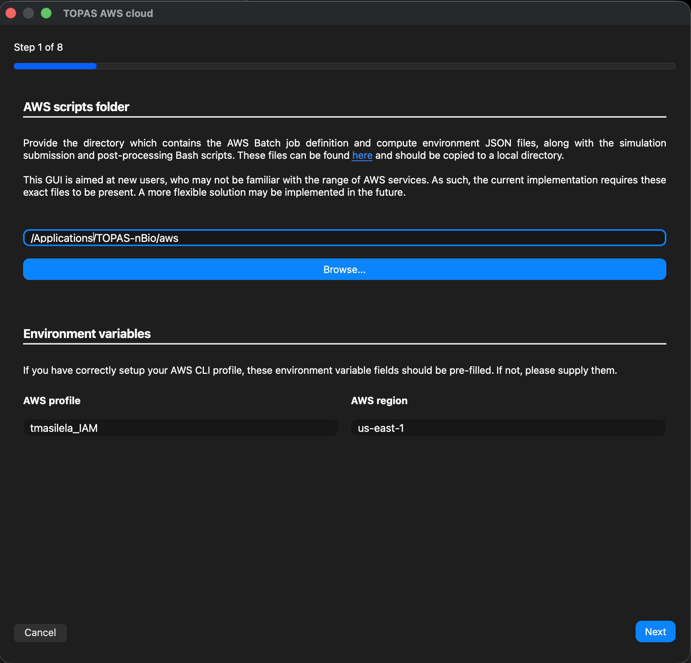
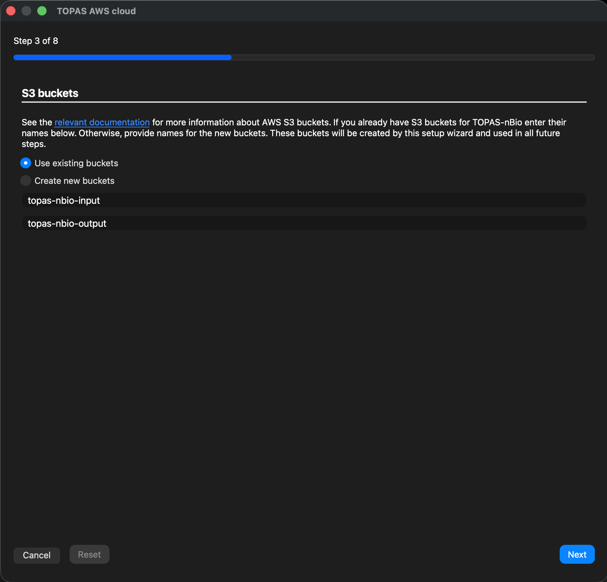
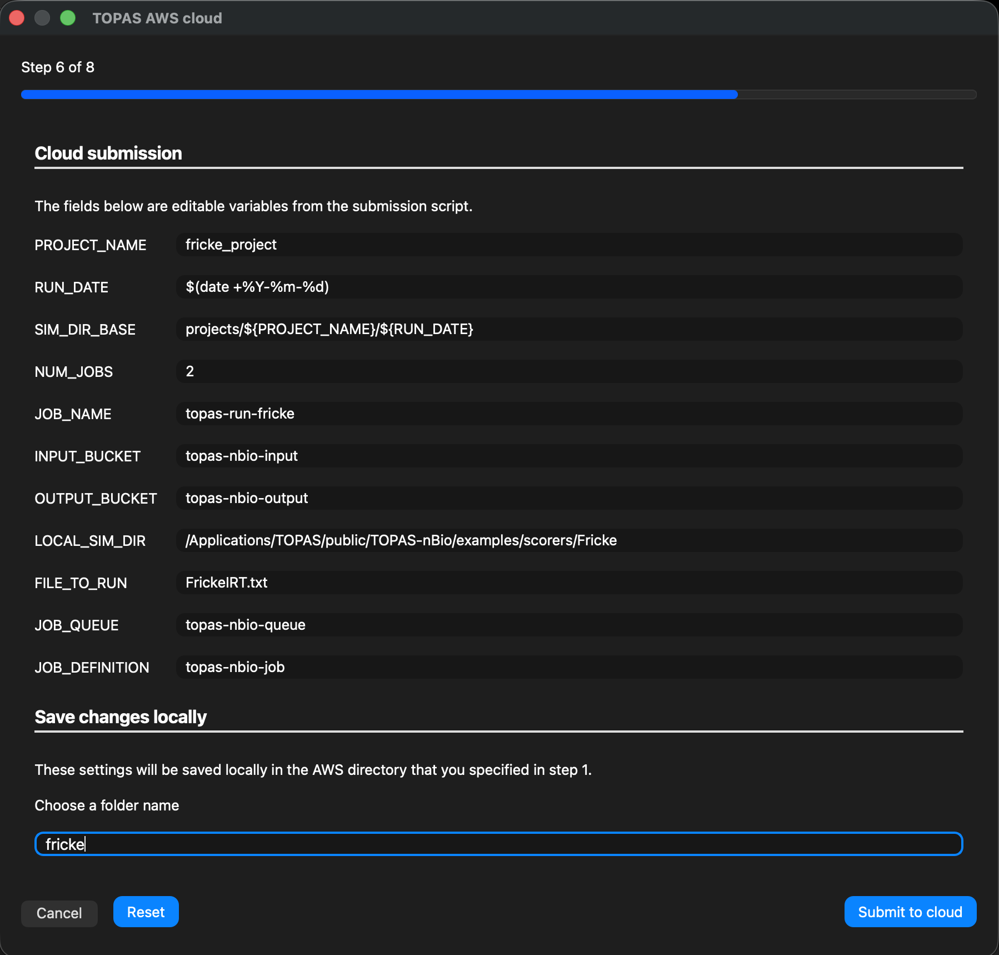
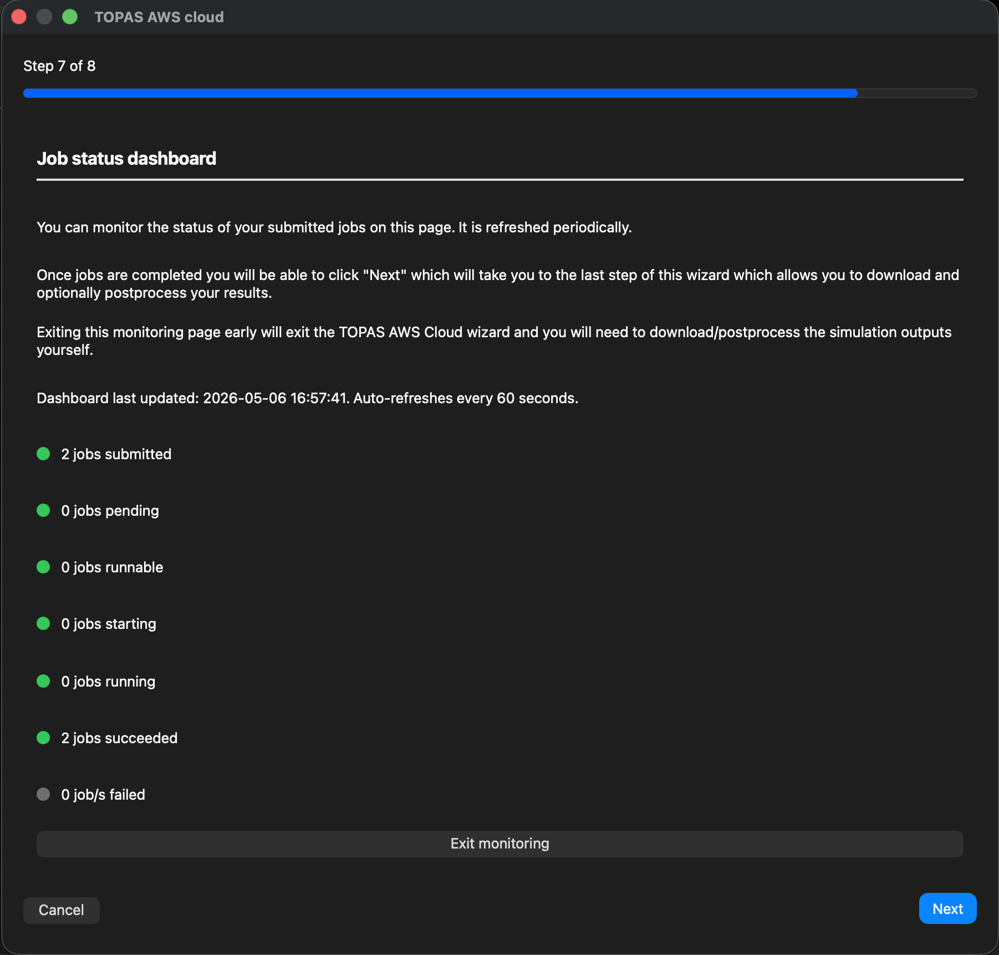
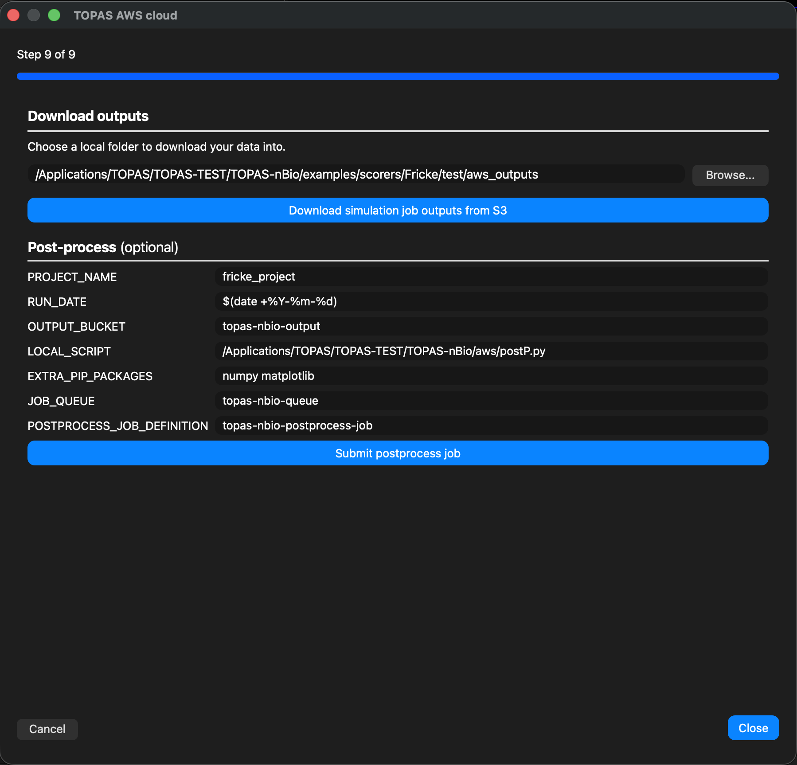

.. _cloud:

Cloud
-----

Welcome to the ...! We have added ... capabilities to the GUI of OpenTOPAS which allows you to run your simulations using AWS compute resources.

This implementation is based on the infrastructure and workflows recently released by TOPAS-nBio. Consequently, you are required to go through 
the setup steps described in the TOPAS-nBio `documentation <https://topas-nbio.readthedocs.io/en/latest/Cloud/CloudOverview.html>`_ before being able 
to use this feature in the GUI. 

If you are fine using the official images released by the TOPAS collaboration, you can skip steps 2 and 3 and only complete steps 1 and 4. 
Through the GUI you are able to complete steps 5-7 in the guide, which corresponds to setting up your AWS resources (i.e. choosing the compute 
resources you would like to allocate, setting up your job, choosing input files, and submitting and monitoring your simulations).

.. note::
    Although steps 5-7 can be completed entirely through the GUI, if you are a **first time user** of AWS compute resources 
    we recommend you follow these steps as described in the TOPAS-nBio `documentation <https://topas-nbio.readthedocs.io/en/latest/Cloud/CloudOverview.html>`_ 
    to have a better understanding of the underlying infrastructure and workflows.

.. warning::
    As the use of AWS compute resources is a paid service, The TOPAS collaboration is not responsible for any charges incurred while using the 
    cloud capabilities of the OpenTOPAS GUI. Please refer to the AWS `billing page <https://aws.amazon.com/aws-cost-management/aws-billing/>`_ 
    for more information on how to manage your AWS costs.

TOPAS AWS cloud wizard
~~~~~~~~~~~~~~~~~~~~~~

The TOPAS AWS cloud wizard can be started by clicking the cloud icon in the GUI. Ensure that your AWS account is authenticated 
(`step 4 <https://topas-nbio.readthedocs.io/en/latest/Cloud/CloudOverview.html>`_) and that you've run the  
command ``aws login`` in the terminal tab before launching OpenTOPAS with your parameter file.

You need to provide the directory containing the aws scripts on the next page. If you've completed the setup steps correctly, your AWS profile 
and region should be automatically filled. 

You will then be asked for "default" vs "advanced" mode. For new users, recommend default since the already provided scripts as templates. 
The advanced mode allows you to directly edit the raw JSON or bash scripts for more fine-tuned control. 

The next set of steps will prompt you to either use existing AWS resources or create new ones. In other words, if you've already gone through the process of launching 
OpenTOPAS/TOPAS-nBio simulations on AWS, you will already have these resources set up and can save time by re-using them. Alternatively, 
you have the option of creating new versions. It is likely that you'll want to choose this option if, for example, the simulations you want 
to launch require significantly more/less computing resources than the simulations you previously launched. The image below is shown for AWS 
`S3 buckets`, but the same window will appear for you to make a decision about the `compute environment`, `job queue`, `job definitions`, 
and CloudWatch `log group`.

Once you've decided to use existing or create new AWS resources you will be taken to the job submission page. This page has fields that are 
pre-filled based on the AWS resources you selected, and if you chose to use the parameter file you opened or the template submission script.

You will then be taken to a monitoring page where you can see the status of your submitted jobs.

Once your jobs are completed you will be redirected to a page to download your results and, if you selected the option to postprocess your results, 
you will also have the option to submit a postprocessing job using your own local script.

.. note::
    Should you encounter any bugs/features which don't quite work as expected, please communicate the issue on our 
    `GitHub page <https://github.com/OpenTOPAS/OpenTOPAS>`_.